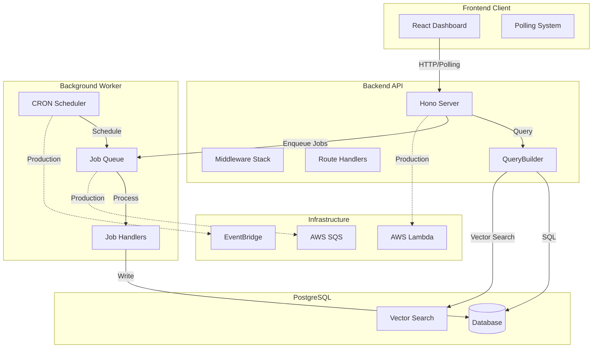
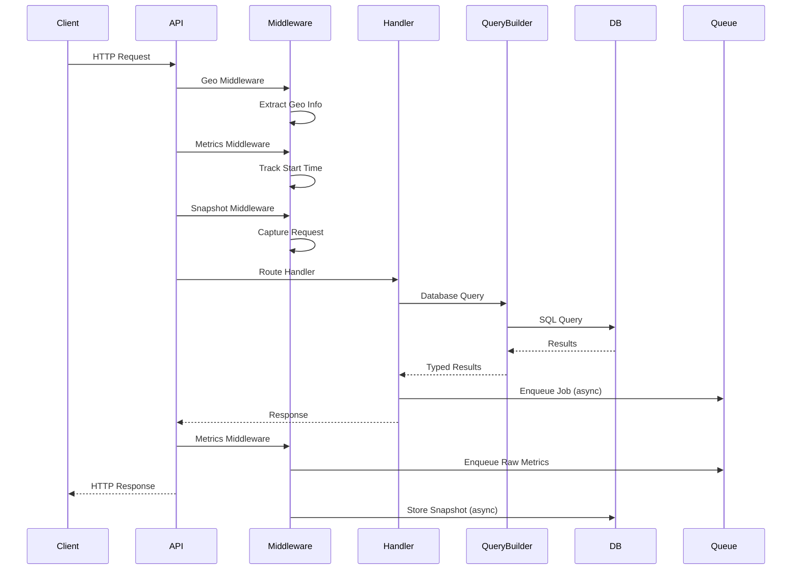

# Architecture

The system consists of three main applications working together:



## Component Descriptions

### Backend API (`apps/backend`)

- **Framework**: Hono (lightweight, fast web framework)
- **Runtime**: Bun (JavaScript runtime)
- **Database**: PostgreSQL with Drizzle ORM
- **Features**:
  - RESTful API with OpenAPI documentation
  - Middleware for metrics collection, request snapshotting, and geo-location
  - QueryBuilder for type-safe database operations
  - Vector embeddings for semantic search
  - Soft delete support

### Frontend Client (`apps/client`)

- **Framework**: React 19 with TypeScript
- **Build Tool**: Vite
- **Styling**: Tailwind CSS
- **Charts**: Recharts
- **State Management**: Zustand
- **Features**:
  - Real-time dashboard with polling-based updates (2-second intervals)
  - Interactive metrics charts
  - Log viewer with filtering
  - Request replay interface
  - Worker job management

### Worker (`apps/worker`)

- **Purpose**: Background job processing
- **Queue System**: SQS (production) or Local (development)
- **Scheduler**: EventBridge (production) or node-cron (local)
- **Job Types**:
  - Metrics aggregation
  - Log cleanup
  - Health checks
- **Features**:
  - Retry logic with exponential backoff
  - Job registry system
  - CRON-based scheduling

### Infrastructure (`infra`)

- **Tool**: Terraform (Infrastructure as Code)
- **Platforms**: AWS Lambda, ECS
- **Services**: SQS, EventBridge, API Gateway, CloudFront, S3
- **State Management**: S3 backend with optional DynamoDB locking

## Request Flow



## Tech Stack

### Runtime

- **Bun**: Fast JavaScript runtime, bundler, and package manager

### Backend

- **Hono**: Ultra-fast web framework
- **Drizzle ORM**: TypeScript ORM with PostgreSQL
- **Zod**: Schema validation
- **@hono/zod-openapi**: OpenAPI integration
- **PostgreSQL**: Database with vector extension support

### Frontend

- **React 19**: UI library
- **Vite**: Build tool and dev server
- **Tailwind CSS**: Utility-first CSS framework
- **Recharts**: Charting library
- **Zustand**: State management
- **React Router**: Client-side routing
- **Radix UI**: Accessible component primitives

### Infrastructure

- **Terraform**: Infrastructure as Code
- **AWS Provider**: AWS service integration
  - Lambda
  - SQS
  - EventBridge
  - API Gateway
  - ECR
  - S3
  - CloudFront
  - ECS

### Development Tools

- **TypeScript**: Type safety
- **ESLint**: Code linting
- **Drizzle Kit**: Database migrations

## Features

### Real-time Metrics Collection

Automatic collection of API performance metrics:

- **Latency Percentiles**: P50, P95, P99
- **Error Rates**: Percentage of failed requests
- **Traffic Counts**: Request volume per endpoint
- **Request/Response Sizes**: Bandwidth tracking
- **Time Windows**: 60-second aggregation windows

Metrics are collected via middleware and processed asynchronously by the worker.

### Real-time Updates

Polling-based real-time updates for logs and metrics:

- Frontend polls for new logs and metrics every 2 seconds
- Uses incremental fetching with `id__gt` filter to get only new records
- Filter by source, level, or message
- Search with keyword and semantic search
- Real-time updates in the dashboard

### Request Snapshot & Replay

Capture and replay HTTP requests:

- **Automatic Capture**: All `/api/v1/*` requests are captured
- **Full Context**: Method, path, query, body, headers, response
- **Geo Information**: Country, region, city, coordinates
- **Replay**: Execute captured requests for debugging
- **Safety**: Blocks replay to sensitive endpoints

### Vector-based Semantic Search

PostgreSQL vector embeddings for semantic search:

- **Hybrid Search**: Combines keyword (ILIKE) and vector (cosine similarity)
- **Automatic Embeddings**: Generated on create/update
- **16-dimensional Vectors**: Lightweight but effective
- **Searchable Fields**: Message, source, level for logs

### Job Queue System

Asynchronous job processing:

- **SQS Integration**: Production-ready queue
- **Local Queue**: Development-friendly in-memory queue
- **Retry Logic**: Exponential backoff on failures
- **Job Types**: Metrics processing, log cleanup, health checks

### CRON Scheduling

Scheduled job execution:

- **EventBridge**: Production scheduling
- **node-cron**: Local development
- **Default Jobs**: Health checks, log cleanup, metrics aggregation

### Geo-location Tracking

Automatic geographic information extraction:

- **Multiple Sources**: Cloudflare, CloudFront, custom headers, IP lookup
- **Fallback Chain**: Platform → Headers → IP → None
- **Data Captured**: Country, region, city, coordinates

### OpenAPI Documentation

Interactive API documentation:

- **Scalar UI**: Beautiful API reference
- **Auto-generated**: From Zod schemas
- **Interactive**: Test endpoints directly
- **Available at**: `/reference`

## Project Structure

```
api/
├── apps/
│   ├── backend/              # Backend API application
│   │   ├── src/
│   │   │   ├── api/          # API routes and handlers
│   │   │   │   ├── routes/
│   │   │   │   │   ├── public/    # Public routes (/api/v1/*)
│   │   │   │   │   │   └── users/
│   │   │   │   │   └── private/   # Private routes (/*)
│   │   │   │   │       ├── logs/
│   │   │   │   │       ├── metrics/
│   │   │   │   │       ├── replay/
│   │   │   │   │       ├── health/
│   │   │   │   │       ├── info/
│   │   │   │   │       ├── error/
│   │   │   │   │       └── worker/
│   │   │   │   └── middlewares/   # Request middleware
│   │   │   │       ├── metrics.ts    # Metrics collection
│   │   │   │       ├── snapshot.ts   # Request snapshotting
│   │   │   │       ├── geo.ts        # Geo-location
│   │   │   │       └── ...
│   │   │   ├── db/           # Database layer
│   │   │   │   ├── models/   # Drizzle schema definitions
│   │   │   │   ├── querybuilder.ts  # Query builder
│   │   │   │   ├── db.ts     # Database connection
│   │   │   │   └── seed.ts   # Database seeding
│   │   │   ├── servers/      # Server implementations
│   │   │   │   ├── http.ts   # HTTP server (Bun)
│   │   │   │   ├── lambda.ts # AWS Lambda handler
│   │   │   │   └── cloudflareworker.ts # Cloudflare Worker
│   │   │   ├── utils/        # Utilities
│   │   │   │   ├── encode.ts      # Vector encoding
│   │   │   │   ├── queue.ts        # Job queue
│   │   │   │   ├── logger.ts       # Logging
│   │   │   │   └── ...
│   │   │   └── migrations/   # Database migrations
│   │   └── package.json
│   │
│   ├── client/               # Frontend React application
│   │   ├── src/
│   │   │   ├── components/   # React components
│   │   │   │   ├── ui/       # UI primitives (shadcn)
│   │   │   │   ├── LogsCard.tsx
│   │   │   │   ├── MetricsChart.tsx
│   │   │   │   └── ...
│   │   │   ├── pages/        # Page components
│   │   │   │   ├── Dashboard.tsx
│   │   │   │   ├── LogsPage.tsx
│   │   │   │   ├── MetricsPage.tsx
│   │   │   │   ├── ReplayPage.tsx
│   │   │   │   └── WorkerPage.tsx
│   │   │   ├── store/        # Zustand store
│   │   │   ├── lib/          # Client utilities
│   │   │   └── hooks/        # React hooks
│   │   └── package.json
│   │
│   └── worker/               # Background worker
│       ├── src/
│       │   ├── jobs/         # Job handlers
│       │   │   ├── handlers/
│       │   │   │   ├── processRawMetrics.ts
│       │   │   │   ├── cleanupLogs.ts
│       │   │   │   └── ...
│       │   │   ├── registry.ts
│       │   │   └── types.ts
│       │   ├── queue/        # Queue implementations
│       │   │   ├── local.ts
│       │   │   └── sqs.ts
│       │   ├── scheduler/    # Scheduler implementations
│       │   │   ├── local.ts
│       │   │   └── eventbridge.ts
│       │   └── index.ts
│       └── package.json
│
├── infra/                    # Infrastructure as Code
│   ├── worker/               # Worker Terraform module
│   ├── lambda/               # Lambda Terraform module
│   ├── client/               # Client Terraform module
│   ├── ecs/                  # ECS Terraform module
│   ├── terraform-run.sh      # Terraform execution script
│   └── infra-run.sh          # Infrastructure deployment helper
│
├── packages/                 # Shared packages
│   └── src/
│       ├── db.ts            # Shared database types
│       ├── types.ts         # Shared TypeScript types
│       └── utils.ts         # Shared utilities
│
└── package.json             # Root workspace config
```

