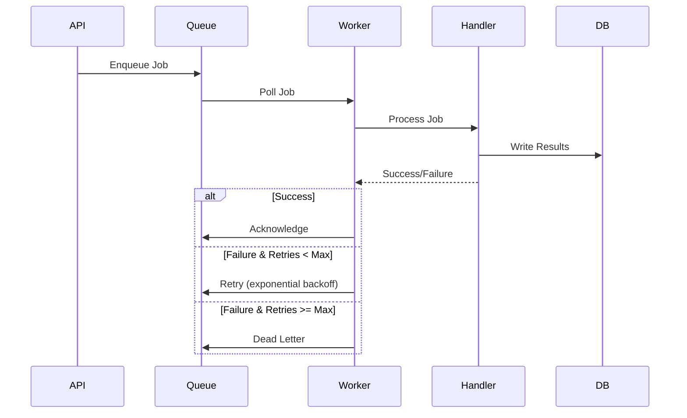

# Worker & Jobs

## Job Types

The worker processes the following job types:

### 1. PROCESS_RAW_METRICS

Aggregates raw metrics into time windows:

- Groups metrics by 60-second windows
- Calculates percentiles (P50, P95, P99)
- Computes error rates
- Stores aggregated metrics

### 2. PROCESS_METRICS

Processes existing metrics (legacy):

- Similar to PROCESS_RAW_METRICS

### 3. CLEANUP_LOGS

Removes old log entries:

- Configurable retention period (default: 30 days)
- Batch processing
- Soft delete support

### 4. HEALTH_CHECK

Performs health checks:

- Database connectivity
- Queue availability
- Scheduler status

## Queue System

### Production (SQS)

```typescript
// Enqueue job to SQS
await enqueueJob(
  JobType.PROCESS_RAW_METRICS,
  {
    metrics: rawMetricsArray,
  },
  {
    maxAttempts: 3,
    delay: 5000, // 5 seconds
  }
);
```

### Development (Local)

The local queue uses an in-memory queue with HTTP endpoint:

```typescript
// Enqueue job to local worker
await enqueueJob(JobType.PROCESS_RAW_METRICS, {
  metrics: rawMetricsArray,
});
```

The worker polls the local queue and processes jobs.

## CRON Scheduling

Default scheduled jobs:

- **Health Check**: Every 5 minutes (`*/5 * * * *`) - heartbeat to keep Lambda active
- **Log Cleanup**: Daily at midnight (`0 0 * * *`)
- **Metrics Processing**: Every 15 minutes (`*/15 * * * *`)

Jobs are defined in `apps/worker/src/scheduler/jobs.ts`.

## Job Processing Flow



## Adding New Jobs

1. **Define Job Type** (`apps/worker/src/jobs/types.ts`):

   ```typescript
   export enum JobType {
     MY_NEW_JOB = "MY_NEW_JOB",
   }
   ```

2. **Create Handler** (`apps/worker/src/jobs/handlers/myNewJob.ts`):

   ```typescript
   export async function myNewJob(payload: MyPayload): Promise<void> {
     // Job logic
   }
   ```

3. **Register Handler** (`apps/worker/src/jobs/registry.ts`):

   ```typescript
   const handlers: JobHandlerMap = {
     [JobType.MY_NEW_JOB]: myNewJob,
     // ...
   };
   ```

4. **Schedule (optional)** (`apps/worker/src/scheduler/jobs.ts`):
   ```typescript
   {
     cronExpression: "0 * * * *",
     jobType: JobType.MY_NEW_JOB,
     payload: {},
     enabled: true,
   }
   ```

