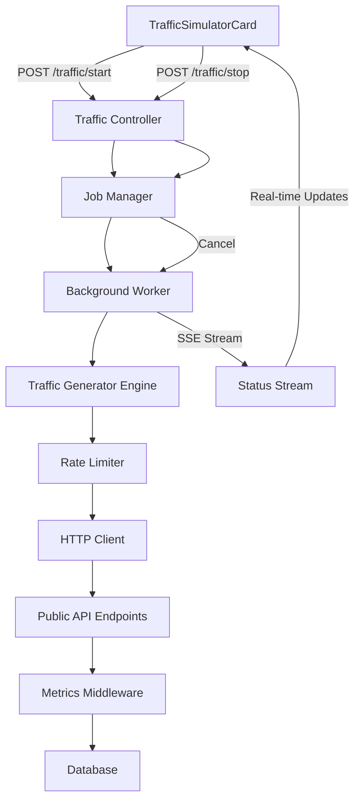

# Traffic Simulator Card Implementation Plan

## Overview
Implement a traffic generation card in the dashboard that allows users to simulate different traffic scenarios (Normal, Peak, Error Injection, Latency Degradation, Stress Test) with configurable duration, RPS limits, and endpoint selection. The traffic generation runs on the backend using Bun's native async capabilities, with real-time status updates via SSE streaming.

## Architecture



## Implementation Steps

### 1. Backend: Traffic Job Management
**File**: `apps/backend/src/api/routes/private/traffic/traffic.routes.ts` (new)
- `POST /traffic/start` - Start traffic generation job
  - Request body: `{ scenario, duration, maxRps, endpoints }`
  - Returns: `{ jobId, status: 'starting' }`
- `GET /traffic/status/:jobId` - Get job status (for polling fallback)
- `POST /traffic/stop/:jobId` - Stop/cancel running job
- `GET /traffic/stream/:jobId` - SSE stream for real-time status updates

**File**: `apps/backend/src/api/routes/private/traffic/traffic.handlers.ts` (new)
- Implement route handlers
- Job state management (in-memory Map for jobId -> job state)
- Integration with traffic generator service

**File**: `apps/backend/src/api/routes/private/traffic/traffic.index.ts` (new)
- Register traffic routes

### 2. Backend: Traffic Generator Service
**File**: `apps/backend/src/services/trafficGenerator.ts` (new)
- Core traffic generation logic
- Scenario engines:
  - **Normal Traffic**: Steady RPS throughout duration
  - **Peak Usage**: Ramp-up, sustain, ramp-down
  - **Error Injection**: Mix normal + error endpoint
  - **Latency Degradation**: Add delays between requests
  - **Stress Test**: Max RPS sustained
- Rate limiting with 20 RPS hard cap
- HTTP client using Bun's native fetch
- Track statistics: total requests, success/failures, latencies, current RPS
- Cancellation support via AbortController

### 3. Backend: Job State Manager
**File**: `apps/backend/src/services/trafficJobManager.ts` (new)
- In-memory job store: `Map<jobId, JobState>`
- Job state interface:
  ```typescript
  interface JobState {
    jobId: string;
    status: 'running' | 'completed' | 'cancelled' | 'error';
    scenario: string;
    startTime: number;
    endTime?: number;
    stats: {
      totalRequests: number;
      successfulRequests: number;
      failedRequests: number;
      avgLatency: number;
      currentRps: number;
    };
    abortController: AbortController;
  }
  ```
- Methods: `createJob()`, `getJob()`, `cancelJob()`, `updateJobStats()`

### 4. Backend: SSE Status Stream
**File**: `apps/backend/src/api/routes/private/traffic/traffic.handlers.ts`
- Implement SSE endpoint using Hono's `streamSSE`
- Stream job status updates every 500ms
- Send final stats when job completes
- Handle client disconnection gracefully

### 5. Backend: Error Endpoint (for Error Injection)
**File**: `apps/backend/src/api/routes/public/users/users.routes.ts`
- Add `GET /api/v1/users/error?errorRate=0.5` route
- Returns errors based on errorRate probability (500, 502, 503, 504)

**File**: `apps/backend/src/api/routes/public/users/users.handlers.ts`
- Implement error handler

**File**: `apps/backend/src/api/routes/public/users/users.index.ts`
- Register error route

### 6. Backend: Route Registration
**File**: `apps/backend/src/api/index.ts`
- Import and register traffic routes in privateRoutes array

### 7. Client: Traffic Generator Hook
**File**: `apps/client/src/hooks/useTrafficGenerator.ts` (new)
- Custom hook to manage traffic generation
- Methods:
  - `startTest(config)` - POST to `/traffic/start`
  - `stopTest(jobId)` - POST to `/traffic/stop/:jobId`
  - `connectStatusStream(jobId)` - Connect to SSE stream
- State: `isRunning`, `currentJobId`, `stats`, `error`
- Auto-cleanup on unmount

### 8. Client: Traffic Simulator Card Component
**File**: `apps/client/src/components/TrafficSimulatorCard.tsx` (new)
- UI matching the mockup:
  - Radio buttons for scenario selection
  - Dropdowns for Duration, Max RPS, Endpoints
  - Checkbox for user acknowledgment
  - Start/Stop button with loading states
  - Real-time statistics display (from SSE stream)
- Use existing UI components (Card, Select, Button, Label, RadioGroup)

### 9. Client: Dashboard Integration
**File**: `apps/client/src/pages/Dashboard.tsx`
- Import and add TrafficSimulatorCard component
- Place after KPI cards or in a dedicated section

## Technical Details

### Rate Limiting Algorithm
- Token bucket: 20 tokens max, refill at 20 tokens/second
- Calculate request interval: `1000ms / targetRps`
- Track actual RPS and adjust if needed
- Hard cap enforcement: never exceed 20 RPS

### Scenario Behaviors
1. **Normal Traffic**: Constant RPS throughout duration
2. **Peak Usage**: 
   - 0-25%: Linear ramp 0 → maxRps
   - 25-75%: Maintain maxRps
   - 75-100%: Linear ramp maxRps → 0
3. **Error Injection**: 
   - 70% normal requests to `/api/v1/users`
   - 30% requests to `/api/v1/users/error?errorRate=0.5`
4. **Latency Degradation**: 
   - Add random sleep (100-500ms) between requests
   - Simulates network congestion
5. **Stress Test**: 
   - Immediate ramp to 20 RPS
   - Maintain for full duration
   - No artificial delays

### Request Distribution
- Rotate through endpoints: GET /users, POST /users, GET /users/:id, PATCH /users/:id
- Generate realistic request bodies for POST/PATCH
- Use proper headers (Content-Type: application/json)
- Track which endpoint each request targets

### Job Lifecycle
1. Client calls `POST /traffic/start` with config
2. Backend creates job, generates jobId, starts background worker
3. Client connects to `GET /traffic/stream/:jobId` (SSE)
4. Background worker generates traffic, updates job stats
5. Job manager updates stats every 500ms
6. SSE stream sends updates to client
7. On completion/cancellation, send final stats and close stream

### Error Handling
- Catch and track failed requests (network errors, 5xx responses)
- Don't stop job on individual failures
- Track error rate in statistics
- Handle job cancellation gracefully (AbortController)
- Clean up resources on job completion

## Files to Create/Modify

### New Backend Files
- `apps/backend/src/api/routes/private/traffic/traffic.routes.ts`
- `apps/backend/src/api/routes/private/traffic/traffic.handlers.ts`
- `apps/backend/src/api/routes/private/traffic/traffic.index.ts`
- `apps/backend/src/services/trafficGenerator.ts`
- `apps/backend/src/services/trafficJobManager.ts`

### Modified Backend Files
- `apps/backend/src/api/routes/public/users/users.routes.ts`
- `apps/backend/src/api/routes/public/users/users.handlers.ts`
- `apps/backend/src/api/routes/public/users/users.index.ts`
- `apps/backend/src/api/index.ts`

### New Client Files
- `apps/client/src/components/TrafficSimulatorCard.tsx`
- `apps/client/src/hooks/useTrafficGenerator.ts`

### Modified Client Files
- `apps/client/src/pages/Dashboard.tsx`

## Implementation Notes

1. **Job ID Generation**: Use `crypto.randomUUID()` or timestamp-based ID
2. **SSE Stream**: Use Hono's `streamSSE` helper (similar to logs/metrics streaming)
3. **Background Execution**: Use Bun's async capabilities, no need for worker threads
4. **Memory Management**: Clean up completed jobs after 5 minutes to prevent memory leaks
5. **Concurrent Jobs**: Consider limiting to 1 active job at a time (or allow multiple)
6. **Error Endpoint**: Simple endpoint that throws errors based on probability

## UI Mockup Reference

```
┌───────────────────────────────────────────┐
│ TRAFFIC SIMULATOR                         │
├───────────────────────────────────────────┤
│ Scenario                                  │
│ ○ Normal Traffic                          │
│ ○ Peak Usage                              │
│ ○ Error Injection                         │
│ ○ Latency Degradation                     │
│ ○ Stress Test (Safe) ⚠️                   │
│                                           │
│ Duration:     [ 2 minutes ▼ ]             │
│ Max RPS:      [ 20 ▼ ] (hard capped)      │
│ Endpoints:    [ All ▼ ]                   │
│                                           │
│ ☑ I understand this generates load        │
│                                           │
│ [ START TEST ]                             │
└───────────────────────────────────────────┘
```

## Testing Considerations
- Verify rate limiting works correctly (hard cap at 20 RPS)
- Test all scenarios independently
- Ensure error endpoint generates errors at expected rate
- Verify metrics are captured correctly by existing middleware
- Test cancellation/cleanup when job is stopped
- Test SSE stream reconnection handling
- Verify job cleanup after completion

